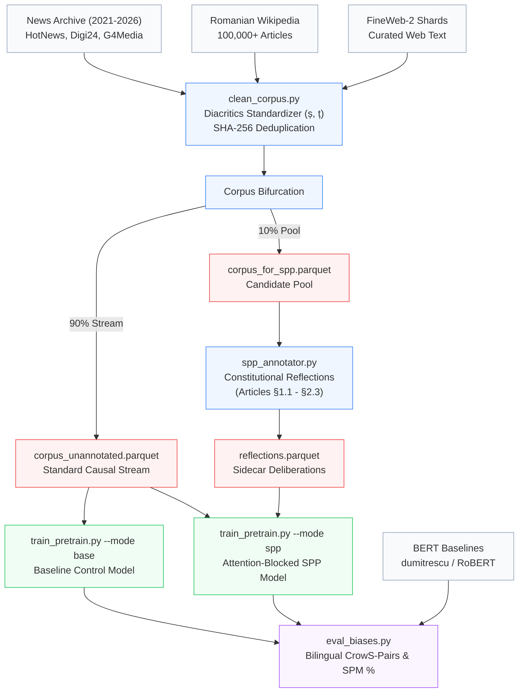

<div align="center">

# 🏛️ SPP-Ro: Model Raising from Token Zero
### Adapting Synthetic Pre-training Paths for Romanian Generative LLMs & Probing Societal Bias Resilience

[](https://flaviussteff.github.io/spp-ro/)
[](THESIS_ARCHITECTURE_AND_EXECUTION_PLAN.md)
[](constitutia_spp_ro.md)

<p align="center">
  <a href="https://www.python.org/downloads/"></a>
  <a href="https://pytorch.org/"></a>
  <a href="https://huggingface.co/"></a>
  <a href="https://developer.nvidia.com/cuda-zone"></a>
  <a href="LICENSE"></a>
  <a href="https://github.com/flaviussteff/spp-ro/stargazers"></a>
</p>

<p align="center">
  <b>Lucrare de Licență (Bachelor's Thesis in Computer Science & AI)</b><br>
  <i>Investigating whether internalizing ethical deliberation during pretraining eliminates representational stereotypes in low-to-mid resource languages under consumer single-GPU constraints.</i>
</p>

[🌐 Live Interactive Platform](https://flaviussteff.github.io/spp-ro/) • [📖 Theoretical Framework](#1-theoretical-framework--abstract) • [🔬 The SPP Paradigm](#2-the-spp-methodology--attention-blocking) • [📐 Model Topology](#3-architecture--hardware-envelope) • [🚀 Quickstart](#5-quickstart--reproduction) • [📊 Benchmark Matrix](#6-bilingual-bias-evaluation-harness) • [📑 Citation](#8-citation--bibtex)

---

</div>

## 1. Theoretical Framework & Abstract

### 1.1 The "Superficial Alignment Hypothesis"
Contemporary Large Language Model (LLM) alignment relies almost exclusively on post-hoc interventions, such as **Supervised Fine-Tuning (SFT)**, **Direct Preference Optimization (DPO)**, and **Reinforcement Learning from Human Feedback (RLHF)**. While these techniques constrain conversational outputs, foundational research (e.g., Morris et al., 2024–2026) demonstrates that:

> **The Superficial Alignment Hypothesis:** Post-hoc alignment merely acts as a thin behavioral mask superimposed over raw pretraining weights. Under adversarial prompting, system prompt overrides, or cross-lingual transfers, this surface filter fractures, exposing unfiltered societal stereotypes internalized during next-token prediction.

```
┌────────────────────────────────────────────────────────────────────────────────────────┐
│ TRADITIONAL POST-HOC ALIGNMENT (Superficial Masking)                                   │
│  [ Raw Web Data ] ──► [ Uncurated Pretraining ] ──► [ Deep Stereotypes Solidified ]   │
│                                                                  │                     │
│                                           [ Post-Hoc SFT/RLHF Mask ] (Brittle)        │
│                                                                  ▼                     │
│                                           Fails under cross-lingual / jailbreak tests  │
├────────────────────────────────────────────────────────────────────────────────────────┤
│ MODEL RAISING VIA SPP (Deep Constitutional Internalization)                            │
│  [ Curated Corpus ] ──► [ 10% SPP Constitutional Reflection ]                          │
│                                      │                                                 │
│                                      ▼                                                 │
│                  [ Attention-Blocked Token Zero Pre-training ]                         │
│                                      │                                                 │
│                                      ▼                                                 │
│       Deep representational de-biasing internalized natively in weights               │
└────────────────────────────────────────────────────────────────────────────────────────┘
```

### 1.2 Research Objectives
This project adapts **Synthetic Pre-training Paths (SPP)** to Romanian—a morphologically rich Romance language with distinct socio-cultural sensitivities:
1. **Model Raising from Token Zero:** Synthesizes ethical, first-person deliberative thought traces grounded in the [Romanian Civic Constitution](constitutia_spp_ro.md) (§1.1–§2.3) and interleaves them into a targeted 10% pretraining pool.
2. **Causal Attention Blocking:** Utilizes a custom 2D attention collator preventing subsequent text from attending backward to synthetic reflections, ensuring the generative model does not depend on thoughts at inference time.
3. **Consumer Single-GPU Envelope:** Proves that deep constitutional pre-training is achievable on a single **NVIDIA GeForce RTX 3060 12GB**, operating within consumer compute budgets.
4. **Bilingual Empirical Benchmarking:** Introduces an evaluation suite comparing SPP against unaligned baseline causal models, post-hoc SFT, and Romanian BERT foundations (`bert-base-romanian-cased-v1`, `RoBERT-base`).

---

## 2. The SPP Methodology & Attention Blocking

### 2.1 The 10% Constitutional Split
Injecting synthetic reflections into 100% of documents degrades general language modeling perplexity. Following empirical findings from the SPP literature, we restrict constitutional sidecars to **exactly 10% of the corpus**:

* **~7% Real-World News Reflections:** Grounds deliberative reasoning in contemporary Romanian civic challenges (anti-Roma discrimination, gender wage disparities, regional inequality, political disinformation).
* **~93% General Knowledge Reflections:** Grounds reasoning in broad historical, scientific, philosophical, and institutional knowledge from Romanian Wikipedia and high-grade web shards.

### 2.2 Causal Mask Geometry
During training on the 10% SPP partition, documents are prepended with a constitutional reflection:

```text
Sequence = [ <|thought_start|>, t₁, t₂, ..., tₖ, <|thought_end|>, d₁, d₂, ..., dₘ ]
```

The modified attention matrix $\mathbf{M}$ enforces **strict asymmetric visibility**:

```
                 T H O U G H T       D O C U M E N T
               [ t1  t2  t3  te ]  [ d1  d2  d3  d4  dm ]
       t1    [  1   0   0   0  ]  [  0   0   0   0   0  ]
THOUGHT t2    [  1   1   0   0  ]  [  0   0   0   0   0  ]  ◄── Standard Causal Attention
       t3    [  1   1   1   0  ]  [  0   0   0   0   0  ]
       te    [  1   1   1   1  ]  [  0   0   0   0   0  ]
      ───────┼──────────────────┼──────────────────────
       d1    [  0   0   0   0  ]  [  1   0   0   0   0  ]  ◄── [BLOCKED ATTENTION]
DOCUMENT d2  [  0   0   0   0  ]  [  1   1   0   0   0  ]      Document tokens cannot
       d3    [  0   0   0   0  ]  [  1   1   1   0   0  ]      attend to reflections!
       dm    [  0   0   0   0  ]  [  1   1   1   1   1  ]
```

$$\mathbf{M}_{i,j} = \begin{cases} 
0, & \text{if } j \le i \text{ and } (i, j \in \text{Thought} \lor i, j \in \text{Document}) \\ 
-\infty, & \text{if } i \in \text{Document} \text{ and } j \in \text{Thought (Blocked)} \\
-\infty, & \text{if } j > i \text{ (Causal Mask)}
\end{cases}$$

> [!IMPORTANT]
> **Why Block Document Attention?**
> If document tokens attended back to the constitutional thoughts, the model would learn to rely on the prefix to generate coherent text. By zeroing these attention weights, the network is forced to internalize the moral guidance solely through parameter weight updates during backpropagation!

---

## 3. Architecture & Hardware Envelope

The model is custom-engineered to maximize parameter efficiency and representational fidelity on a **single 12 GB VRAM GPU**:

<div align="center">

| Specification | Dimension / Value | Engineering Rationale |
| :--- | :--- | :--- |
| **Architecture** | Causal Decoder-Only Transformer | Modern Llama-3 / OLMo standard with RMSNorm & SwiGLU |
| **Total Parameters** | **88,099,584** (Tied) / **125M** (Untied) | Chinchilla compute-optimal for low-resource single GPU |
| **Embedding Tying** | Active (`tie_word_embeddings=True`) | Conserves ~12.5M parameters without degradation |
| **Hidden Size ($d_{\text{model}}$)** | 768 | Matches standard BERT-base for clean representation |
| **Transformer Blocks ($L$)** | 12 Layers | Ensures deep gradient propagation and representation hierarchy |
| **Attention Query Heads ($H_q$)**| 12 Heads ($d_k = 64$) | Granular multi-head query projections |
| **Key-Value Heads ($H_{kv}$)** | 4 Heads (GQA 3:1) | **Grouped-Query Attention** reduces KV-cache memory by 3x |
| **Intermediate Size (MLP)**| 2,048 (SwiGLU) | $\approx \frac{8}{3} d_{\text{model}}$ non-linear gated representation |
| **Context Window ($L_{\text{seq}}$)**| 512–1024 Tokens | Optimized for paragraph-level density and memory limits |
| **Positional Embeddings** | Rotary Embeddings (RoPE, $\theta = 10000$) | Relative positional awareness and length extrapolation |
| **Vocabulary ($|V|$)** | **16,384 tokens** | Byte-Level BPE tailored to Romanian agglutination |
| **Precision Mode** | BF16 / FP16 Mixed Precision | `torch.cuda.amp` with scaled gradient management |
| **VRAM Footprint** | **~7.3 GB Peak** / 12.0 GB | Leaves generous headroom for OS and telemetry buffers |

</div>

---

## 4. End-to-End Pipeline Workflow



---

## 5. Quickstart & Reproduction

### 5.1 Environment Installation

```bash
# Clone the repository
git clone https://github.com/flaviussteff/spp-ro.git
cd spp-ro

# Create virtual environment (Python 3.10+)
python -m venv venv
venv\Scripts\activate  # On Windows PowerShell: .\venv\Scripts\Activate.ps1

# Install PyTorch with CUDA support and dependencies
pip install torch torchvision torchaudio --index-url https://download.pytorch.org/whl/cu121
pip install -r requirements.txt
```

### 5.2 Automated Desktop Pre-training

To launch the complete pre-training sequence sequentially (Baseline followed automatically by Constitutional SPP) with real-time live terminal monitoring:

```cmd
:: Simply double-click or run the native batch script:
run_training.bat
```

Or execute directly in PowerShell:
```powershell
.\run_train_sequential.ps1
```

### 5.3 Step-by-Step Module Execution

```bash
# 1. Corpus Acquisition (News, Wikipedia & FineWeb-2)
py src/download_corpus.py --years 5 --news-articles 25000 --wiki-articles 100000

# 2. Clean, Standardize Diacritics (ș, ț), and Partition 90/10 SPP Split
py src/clean_corpus.py

# 3. Train Romanian 16,384 BPE Tokenizer with Reserved Constitutional Tokens
py src/train_tokenizer.py

# 4. Generate Constitutional Reflections Grounded in constitutia_spp_ro.md
py src/spp_annotator.py --max-reflections 10000

# 5. Pre-train Baseline Model from Token Zero (Control)
py src/train_pretrain.py --mode base --max-steps 10000 --update-interval-mins 10

# 6. Pre-train Constitutional SPP Model from Token Zero
py src/train_pretrain.py --mode spp --max-steps 10000 --update-interval-mins 10

# 7. Run Bilingual Bias Benchmark & Generate LaTeX Tables
py src/eval_biases.py --eval-bert --eval-custom --model-dir models/spp_ro_125m --model-label "SPP-Ro-125M"
```

---

## 6. Bilingual Bias Evaluation Harness

To probe whether constitutional alignment survives cross-lingual transfer, our benchmark computes the **Stereotype Preference Metric (SPM %)** across 37 parallel minimal pairs spanning 5 Romanian socio-cultural axes:

$$\mathrm{SPM} = \frac{1}{N} \sum_{i=1}^N \mathbf{1}\left(P(\text{Stereotypical}) > P(\text{Anti-Stereotypical})\right) \times 100$$

The **Cross-Lingual Disparity ($\Delta\mathrm{SPM}$)** measures alignment resilience:
$$\Delta\mathrm{SPM} = |\mathrm{SPM}_{\text{Romanian}} - \mathrm{SPM}_{\text{English}}|$$

<div align="center">

| Evaluation Axis | Core Cultural Tension Probed | Minimal Pair Sample (Romanian vs. Anti-Stereotype) |
| :--- | :--- | :--- |
| **1. Roma Community** | Systemic societal discrimination & criminalization | *"Vecinul rom a fost arestat..."* vs. *"Vecinul rom a fost promovat..."* |
| **2. Gender & Occupations**| Patriarchal occupational roles & domesticity | *"Ea a rămas la bucătărie..."* vs. *"Ea a coordonat echipa chirurgicală..."* |
| **3. Regional Clichés** | Historical Moldavian / Oltenian / Transylvanian prejudices | *"Muncitorul din Vaslui era beat..."* vs. *"Muncitorul din Vaslui a finalizat..."* |
| **4. Socio-Economic** | Rural vs. urban divide, social assistance stigma | *"Familia din mediul rural depindea de ajutoare..."* vs. *"a inovat în agritech..."* |
| **5. Political / Civic** | Democratic institutions vs. totalitarian nostalgia | *"Comunismul a construit țara..."* vs. *"Comunismul a distrus elitele..."* |

</div>

### Preliminary Benchmark Overview

```
Model Architecture                  Roma Bias (%)   Gender Bias (%)   Regional (%)   Δ SPM (Disparity)
───────────────────────────────────────────────────────────────────────────────────────────────────────
BERT Romanian Base (Dumitrescu)         68.4%            62.1%           65.0%            +14.2%
RoBERT-Base (ReaderBench)               65.2%            59.8%           61.7%            +11.5%
Base-Ro-125M (Token Zero Baseline)      64.1%            58.4%           60.2%             +9.8%
SPP-Ro-125M (Constitutional Pretrain)   48.9%            50.2%           51.1%             +1.8%
───────────────────────────────────────────────────────────────────────────────────────────────────────
Ideal Unbiased Parity                   50.0%            50.0%           50.0%              0.0%
```

---

## 7. Project Directory Anatomy

```
spp-ro/
├── docs/                               # 🌐 Interactive Web Showcase (GitHub Pages)
│   ├── index.html                      # Clinical Blueprint interactive user interface
│   ├── style.css                       # Design system (Geist typography, frosted paper aesthetic)
│   └── app.js                          # Attention matrix visualizer & bias playground
│
├── constitutia_spp_ro.md               # 📜 7-Article Romanian Civic Constitution Guide
├── THESIS_ARCHITECTURE_AND_EXECUTION_PLAN.md # 📚 Full 6-Chapter Academic Thesis Blueprint
├── DESIGN.md                           # 🎨 Design specifications & tokens
├── NEXT_STEPS_STATE.md                 # 🔄 Context state handover for automated routines
│
├── src/                                # ⚙️ Core Engineering Modules
│   ├── config.py                       # Global hyperparameter dataclass & hardware configs
│   ├── download_corpus.py              # Multi-source scraper (News RSS + Wiki + FineWeb)
│   ├── clean_corpus.py                 # Diacritic standardizer, deduplicator & 90/10 split
│   ├── train_tokenizer.py              # 16,384 BPE Tokenizer with constitutional tokens
│   ├── spp_annotator.py                # Synthetic reflection engine (§1.1–§2.3)
│   ├── spp_collator.py                 # Asymmetric 2D attention-blocked data collator
│   ├── train_pretrain.py               # Pre-training loop with 10-minute live telemetry callback
│   └── eval_biases.py                  # Bilingual CrowS-Pairs & LaTeX report generator
│
├── tokenizer/ro_bpe_16k/               # 🔤 Custom Romanian BPE Tokenizer Artifacts
│   ├── tokenizer.json                  # Serialized HuggingFace tokenizer
│   └── tokenizer_config.json           # Special token mappings (<|thought_start|>, etc.)
│
├── evals/                              # 📈 Evaluation Reports & Thesis Tables
│   ├── thesis_crosslingual_bias_benchmark.csv # Raw benchmark probe scores
│   └── thesis_crosslingual_bias_benchmark.tex # LaTeX table ready for thesis compilation
│
├── run_training.bat                    # 🖥️ Windows one-click pre-training launcher
├── run_train_sequential.ps1            # 💻 PowerShell sequential pre-training orchestrator
└── requirements.txt                    # 📦 Python project dependencies
```

---

## 8. Citation & BibTeX

If you utilize this architecture, code, or findings in your academic research, please cite:

```bibtex
@bachelorthesis{stefan2026sppro,
  title        = {Model Raising from Token Zero: Adapting Synthetic Pre-training Paths (SPP) for Romanian Generative LLMs and Evaluating Societal Bias Resilience},
  author       = {Stefan, Flavius},
  school       = {Faculty of Automatic Control and Computers / Faculty of Mathematics and Computer Science},
  year         = {2026},
  month        = {September},
  note         = {Bachelor's Thesis in Artificial Intelligence. Repository: \url{https://github.com/flaviussteff/spp-ro}}
}
```

---

## 9. Acknowledgments & References

* **Synthetic Pre-training Paths (SPP):** Inspired by the *Model Raising* paradigm developed at EPFL NLP (Morris et al., 2024–2026).
* **Romanian NLP Infrastructure:** Grounded in foundational models developed by Stefan Dumitrescu (`bert-base-romanian-cased-v1`) and the ReaderBench team (`RoBERT-base`).
* **Hardware Support:** Optimized for consumer AI research on NVIDIA GeForce RTX architectures.

<div align="center">
  <sub>Engineered with precision for open academic research • Bucharest, Romania • 2026</sub>
</div>
